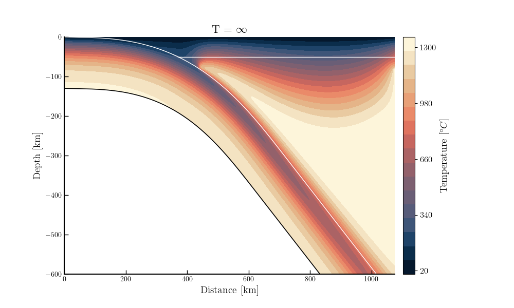

# StonedFenicsx

  

Kynematic thermal numerical code for describing slab temperature evolution

---

## Table of Contents
- [Introduction](#introduction)
- [NumericalMethods](#numerical methods)
- [Domain](#domain)
- [Installation](#installation)
- [Usage](#usage)
- [Contributing](#contributing)
- [License](#license)
- [References](#references)

---

## Introduction

---
## Methods

### Equations  

Stonedfenicsx is a numerical code that solves the continuity, momentum and energy conservation equations using FEM. The numerical model is fully driven by the kynematic boundary condition. The media is incompressible, and the momentum equation does not have any gravitational momentum source. The strong form of the mechanical equation is: 

- **Mass conservation**: $\nabla \cdot u = 0$ 
    - $u$: velocity field 
- **Momentum conservation**: $\nabla \cdot \mathbf \tau + \nabla \cdot P = 0$
    - $\tau$: *deviatoric stress*: $\tau = 2 \cdot \eta_{\mathrm{eff}} \cdot \dot{\mathbf{\varepsilon}}$
        - $\dot{\mathbf{\varepsilon}}$: *deviatoric strain tensor*: $\dot{\mathbf{\varepsilon}} = \frac{1}{2} \cdot (\nabla u + \nabla u ^{T}) $
        - $\eta_{\mathrm{eff}}$: *effective viscosity* : $\eta_{\mathrm{eff}} = f(T,P,\dot{\mathbf{\varepsilon}}_{II})$
        - $\dot{\varepsilon}_{II}$: *deviatoric strain rate second invariant*: $\dot{\varepsilon}_{II} = \sqrt{\frac{1}{2} \cdot \mathbf{\dot{\varepsilon}}:\mathbf{\dot{\varepsilon}}}$

The resolution of these equations gives a velocity and pressure field. The effective
viscosity ($\eta_{\mathrm{eff}}$) can depend on the temperature, pressure and strain rate second invariant. 

The code solves both the steady-state and time-dependent conservation of energy. 
- **Steady-state energy conservation equation**:   $\nabla \cdot (k \cdot \nabla \cdot T) + \rho \cdot C_p \cdot \nabla \cdot T + H= 0$
- **Time-dependent energy conservation equation**: $\rho \cdot C_p \cdot \frac{\partial T}{\partial t} + \rho \cdot C_p \cdot \nabla \cdot T + \nabla \cdot (k \cdot \nabla \cdot T)  + H = 0 $
  - $k$   : *Heat conductivity* [W m/ K ]: $k = f(P,T)$ 
  - $C_p$ : *Heat capacity*     [kJ/kg/K]: $C_p = f(T)$ 
  - $\rho$: *Density*            $[kg/m^3]$: $\rho = f(P,T)$       
  - $t$   : *time* 
  - $H$   : *source term* $[W/m^3]$. Radiogenic heat production or/and shear heating and/or adiabatic heating. 

The material properties required to solve both the steady-state and time-dependent equations can depend on temperature and pressure. Pressure depends on the velocity field, and without the gravitational momentum source is not reliable for computing the material properties. To compute the pressure and temperature dependent material properties, it is necessary to introduce a lithostatic pressure field. The lithostatic pressure field is computed following *Jourdon et al, 2022* [1]. The strong form for solving the lithostatic pressure field (i.e., steady state stokes) is: 

- **Lithostatic Pressure**: $\nabla \cdot \nabla \left( P^{L}\right) - \nabla \cdot \left(\rho g \right) = 0$
    - g: *gravity acceleration vector* 

This equation gives as results a lithostatic pressure field that can be used to compute the material property as a function of depth. Thus, we assume that the dynamic and lithostatic pressure are the same. We use a simplified adiabatic heating for accounting for this process. 

## Numerical methods 

The continuum mechanics equations are solved using Finite Element Method (FEM). The discretisation of the problem and the assembly of the stiffness matrix is handled by Fenicsx libraries (dolfinx [2], ufl[3], and basix[4,5])

### Material Properties 

#### Rheological Model 

Viscosity can be *linear* and *non-linear*. Linear viscosity can be either constant or depend on temperature, and pressure. Non linear viscosity depends on strain rate, pressure and temperature. Rocks flow is a consequence of microcrystalline processes such as diffusion and dislocation creep. The effective viscosity of rocks is given by the combination of diffusion and dislocation creep. 

The general form of the rheological law is: 

$$
\eta= \frac{1}{2} B^{-\frac{1}{n}} \cdot d ^{-m} \cdot \dot{\varepsilon}_{II}^{\frac{1-n}{n}} \cdot \exp{\frac{E + P\cdot V}{n \cdot R \cdot T}} 
$$

- $B$ is the preexponential constant $[Pa ^ {-n} s]$
- $d$ is the grain size $[m]$
- $m$ is the grain size exponent. $m=0$ for dislocation creep. 
- $n$ is the stress exponent. $n=1$ for diffusion creep. 
- $E$ is the activation energy $[kJ/mol]$. 
- $V$ is the activation volume $[cm/mol]$.
- $R$ is the gas constant      $[kJ/mol/K]$.

The effective viscosity for a given strain rate, pressure and temperature can be computed as the harmonic average of the diffusion (*dif*) and dislocation (*dis*) viscosities. Diffusion and dislocation creep exponentially depend on temperature, thus, as a function of the temperature field, it is expected significant variation of viscosity ($> 10$ order of magnitude) especially for geodynamic applications (such as thermal modelling of the mantle wedge). To improve the numerical stability, it is necessary to introduce a cap viscosity: $\eta_{max}$ and then combine with the effecitve viscosity yielding: 

$$
\eta_{\mathrm{eff}} = \left( \frac{1}{\eta_{\mathrm{dif}}}+\frac{1}{\eta_{\mathrm{dis}}}+ \frac{1}{\eta_{\mathrm{max}}}\right)^{-1}
$$

In the future, this model will be substitute with the local iteration approach. The local iteration approach rely on finding the strain rate partitioning between maximum, diffusion and dislocation creep. This approach requires an iterative scheme that finds the stress ($\tau^{G}$) that satisfies the following equation: 

$$
\dot{\varepsilon}_{II} - \dot{\varepsilon}_{\mathrm{max}} - \dot{\varepsilon}_{\mathrm{dif}} - \dot{\varepsilon}_{\mathrm{dis}} = 0  
$$

where: 
- $\dot{\varepsilon}_{\mathrm{max}}= \frac{1}{2 \eta_{\mathrm{max}}}\cdot \tau^{G}$
- $\dot{\varepsilon}_{\mathrm{dis}}=B_{\mathrm{dis}} \cdot \tau^{n,G} \cdot \exp{\frac{E_{\mathrm{dis}} + P \cdot V_{\mathrm{dis}}}{R \cdot T}}$
- $\dot{\varepsilon}_{\mathrm{dif}}=B_{\mathrm{dif}} \cdot \tau^{G} \cdot \exp{\frac{E_{\mathrm{dif}} + P \cdot V_{\mathrm{dif}}}{R \cdot T}}$

This approach is the most correct, as the harmonic average viscosity underestimate the viscosity. It will be implemented in the future. 

### Density 

Density is computed as a function of pressure, temperature and a reference density: 

$$
\rho = \rho_0 \exp(cf_T)\exp(cf_P) 
$$
where 
- $cf_T = (\alpha_0 * (T - T_{0}) + (\frac{\alpha_1}{2}) * (T^2 - T_0^2))$
    - $\alpha_0$ $[1/K]$ and $\alpha_1$ $[1/K^2]$ are constants. 
- $cf_P = P \cdot \beta $
    - $\beta$ is the compressibility $[\frac{1}{Pa}]$ 

### Heat Capacity 

Heat capacity is computed using the following equations: 

$$
Cp = Cp_0 +Cp_1 \cdot T^{-0.5} + Cp_2 * T ^{-2} + Cp_3 * T ^{-3} + Cp_4 * T + Cp_5 * T ^{2}
$$

where
- $Cp_{0,1,2,3,4,5}$ are constant $J * K^{-1,0.5,1,2,-2,-3} * kg^{-1}$ 

### Heat conductivity 

  

Heat conductivity is computed starting from the diffusivity (following Richard et al 2020)[6]. 

In StonedFenicx conductivity is implemented using the following formula: 

$$
k(P,T) = k_0 \cdot o_0 + \kappa(T) \cdot \rho(P,T) \cdot C_p(T) * k(P) + k_{rad}(T)
$$

$k_0$ is the constant conductivity. $o_0$ is a factor that is 0 when the pressure and temperature dependency of the conductivity is not consider. $\kappa(T)$ is the lattice thermal diffusivity ($\frac{m^2}{s}$), $\rho(P,T)$ is the density, $C_p(T)$ is the heat capacity. $k(P)$ is a factor to account for the pressure dependency of the heat conductivity and $k_{rad}$ is the radiative heat conductivity. $k(P)$ is the pressure dependency factor that controls how the conductivity evolves with pressure. 

The temperature dependent thermal diffusivity is computed using the following equation:

$$
\kappa(T) =  \kappa_0 + \kappa_1 \cdot exp\left(- \frac{T-T_0}{\kappa_2}\right)+\kappa_3 \cdot exp\left(- \frac{T-T_0}{\kappa_4}\right)
$$

where $\kappa_{0,1,3}$ are reference thermal diffusivities, $T_0$ is the reference temperature (273.15 K in all the code) and $\kappa_{3,4}$ are empirical constant ($K$). 

After the temperature dependent thermal diffusivity is computed, it is multiplied with the density and heat capacity. 

$$
k(T) = \kappa(T) * \rho(T,P) * C_p(T)
$$

Heat conductivity can be also pressure-dependent (NB: if the density changes as a function of pressure, k(T) is also implicitly a function of pressure). The pressure-dependency is computed multiplying $k(T)$ using the partial derivative of $k$ w.r.t the pressure: 

$$
k(T,P) = k(T) \cdot exp \left(\frac{\partial ln(k)}{\partial P} P\right)
$$

where $\frac{\partial ln(k)}{\partial P}$ is treated as a constant (which will be always $0.05/1e9$ $W/m/K/Pa$). 

The code can account for the radiative conductivity. It follows the formulation of [6]: 

$$
k_{rad}(T) = A_r \cdot\left( - \frac{T-T_a}{2 \cdot \xi_A^2} \right) + B_r \cdot \left( - \frac{T-T_b}{2 \cdot \xi_B^2} \right)
$$

where $A_r$, $B_r$, $T_a$, $T_b$, $\xi_a$, and $\xi_b$ are empirical fitting parameters that depends on the grain size $d$. 

\[
A_r = 1.8\left[1 - \exp\left(-\frac{d^{1.3}}{0.15}\right)\right]
      - \left[1 - \exp\left(-\frac{d^{0.5}}{5}\right)\right],
\]

\[
B_r = 11.7\,\exp\left(-\frac{d}{0.159}\right)
      + 6\,\exp\left(-\frac{d^{3}}{10}\right),
\]

\[
T_a = 490
      + 1850\,\exp\left(-\frac{d^{0.315}}{0.825}\right)
      + 875\,\exp\left(-\frac{d}{0.18}\right),
\]

\[
T_b = 2700
      + 9000\,\exp\left(-\frac{d^{0.5}}{0.205}\right),
\]

\[
\xi_a = 167.5
      + 505\,\exp\left(-\frac{d^{0.5}}{0.85}\right),
\]

\[
\xi_b = 465
      + 1700\,\exp\left(-\frac{d^{0.94}}{0.175}\right).
\]

All these variable can be treated as constants, with a constant $d$ of $0.5$ $cm$. In the future, will be an additional parameter.

---

## Installation

---

## References 
[1]: Jourdon, A. and May, D. A.,*An efficient partial-differential-equation-based method to compute pressure boundary conditions in regional geodynamic models* DOI: 10.5194/se-13-1107-2022
[2]: I. A. Baratta, J. P. Dean, J. S. Dokken, M. Habera, J. S. Hale, C. N. Richardson, M. E. Rognes, M. W. Scroggs, N. Sime, and G. N. Wells. *DOLFINx: The next generation FEniCS problem solving environment, preprint (2023).* DOI: doi.org/10.5281/zenodo.10447666
[3]:M. S. Alnaes, A. Logg, K. B. Ølgaard, M. E. Rognes and G. N. Wells. *Unified Form Language: A domain-specific language for weak formulations of partial differential equations, ACM Transactions on Mathematical Software 40 (2014).* DOI:doi.org/10.1145/2566630
[4]:M. W. Scroggs, J. S. Dokken, C. N. Richardson, and G. N. Wells. *Construction of arbitrary order finite element degree-of-freedom maps on polygonal and polyhedral cell meshes, ACM Transactions on Mathematical Software 48(2) (2022) 18:1–18:23.* DOI: doi.org/10.1145/3524456
[5]: M. W. Scroggs, I. A. Baratta, C. N. Richardson, and G. N. Wells. *Basix: a runtime finite element basis evaluation library,* DOI: doi.org/10.21105/joss.03982
[6]: R, Fred, et al. Structure and dynamics of the oceanic lithosphere-asthenosphere system. Physics of the Earth and Planetary Interiors, 2020, 309: 106559.