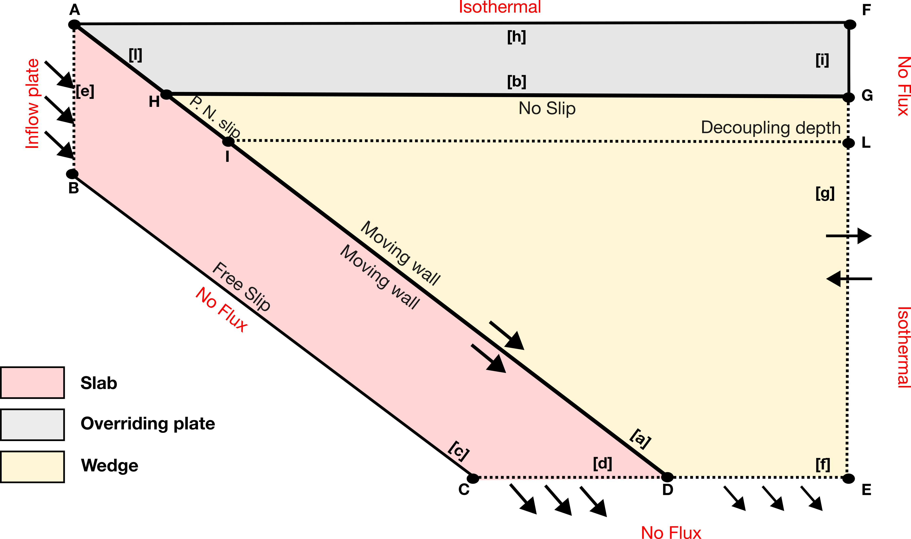

# StonedFEniCSx

*Fig 1: Simplified model setup used in StonedFEniCSx*

A FEniCSx (dolfinx)-based FEM package for simulating the thermal and mechanical evolution of a 2D subduction zone: coupled steady-state/time-dependent thermal, Stokes (velocity–pressure), and lithostatic pressure problems on wedge, slab, and global sub-domains, with temperature- and pressure-dependent rheology and shear heating.

The project started as a Python script built on the [FieldStone](https://cedricthieulot.net/fieldstone.html) educational framework and has since grown into a structured, class-based FEM package. 

## Status

The code is still under development. The next steps are to introduce new tests and provide an automatic testing framework. The user guide needs to be updated, and it should refer to additional repositories where a few examples have been set up. For now, I released the version v 0.0.0-alpha. 

> [!NOTE]
> **Development status**
>
> StonedFEniCSx is research software developed at the University of Leeds and is currently maintained by a single developer. The package is under active development, and some interfaces may change between development versions.
>
> This README currently serves as the main user and configuration guide. A dedicated and more comprehensive user manual is under development and will progressively replace the detailed documentation provided here. The first stable version of the package and its accompanying documentation are planned for release following completion of the associated manuscript.


## Package layout

```
stonedfenicsx/
├── config/              # Configuration module                                                
├── create_mesh/         # Create Mesh module                
├── material_property/   # Compute material properties
├── solver_module/       # Solution routines
├── output.py            # output module
└── stoned_fenicsx.py    
```
### Features

- 2-D kinematic subduction-zone models
- Steady-state and time-dependent thermal problems
- Stokes velocity–pressure solution in the mantle wedge
- Lithostatic-pressure calculation
- Temperature- and pressure-dependent material properties
- Diffusion and dislocation creep rheologies
- Parametrised shear heating along the slab interface
- Configurable slab and overriding-plate geometries
- Crank–Nicolson time integration
- MPI-parallel execution through FEniCSx/PETSc
- XDMF/HDF5 output
- Validation against the van Keken et al. subduction benchmarks
## Installation

```bash
git clone https://github.com/APiccolo89/StonedFenicsx.git
cd StonedFenicsx

conda env create -f stoned_environment.yml
conda activate stoned_fenicsx

pip install --no-deps -e .
```

## Quick start

A simulation is configured with two YAML-parsed inputs — numerical/I-O/thermal/kinematic controls, and per-phase material properties — which drive `stonedfenicsx.stoned_fenicsx`:

```python
from stonedfenicsx.config.input_parser import parse_input
from stonedfenicsx.stoned_fenicsx import stoned_fenicsx
input_data, ph_in = parse_input("input.yaml")
stoned_fenicsx(input_data, ph_in)
```

`input.yaml` at the repo root is a commented example covering units, numerical controls, shear-heating options, and thermal/kinematic boundary conditions. `stonedfenicsx/stoned_fenicsx.py::test_function` shows a fully scripted example that also overrides material properties in code after parsing. `examples/data` contains region-specific driver datasets. Soon, there will be simple scripts to run simulations for specific regions.

Results are written under `Results/<test_name>/` as XDMF/HDF5 fields.

Simulations are MPI-parallel; run under `mpirun`/`srun` for multi-rank execution.

## Running the tests

```bash
pytest tests/
```

The main physical validation is and `tests/test_benchmark_vankeken.py`, which reproduce reference results from the Van Keken et al. subduction zone benchmark suite (`tests/VanKeken/`) across viscosity/thermal configurations.

## Documentation

The documentation of the code: [StonedFEniCSx](https://apiccolo89.github.io/StonedFenicsx/index.html)
> [!WARNING]
> The documentation is still under construction and will be finalised before the final draft of the manuscript. If you have questions, you can send me an email and I will promptly answer.

## How to use
The code is organized to always require the definition of an *input_file.yml*. The blueprint of the input file can be found in the main folder of the package.
The units of measure in the input code are always: **Myr**, **km**, **cm/yr**, **deg** and **degC** for time, length, velocity, angles and temperatures respectively; the only exception is for the *scaling* options; in this case, the units of measure are **m**, **Pa**, **Pa s** and **deg C** The conversions to SI units and the corresponding scaling are performed internally during the configuration step of the simulation.

### Input File

The input file is divided into 8 subsections:

- **NumericalControls**: the parameters that control the behaviour of the simulation.

- **ShearHeating**: the set of parameters that control the internal boundary heat source (the parametrised shear heating along the seismogenetic zone of the subduction plate).

- **InputOutputControl**: the set of parameters that control where to save the output files, and under which conditions to write a timestep.

- **scaling**: the set of SI units used to scale the parameters of the simulation.

- **thermal_boundary_condition**: the thermal boundary condition configuration parameters.

- **kinematic_boundary_condition**: the kinematic boundary condition configuration parameters.

- **Material_properties**: the material property input parameters.

- **geometry**: the geometric configuration parameters.

#### Numerical Controls

```yaml
it_max: 30 # Maximum number of iterations
tol: 5e-5 # Tolerance of the problem
relax: 0.9 # Relax factor to update the solution
g: 9.81 # Module of the gravitational acceleration 
eta_max: 1.0e26 # Maximum viscosity of the system 
time_max: 2.0  # Maximum time of the simulation [SI = Myr]
steady_state: 1 # Steady state flag: 0 -> time-dependent 1-> steady-state simulation 
decoupling_ctrl: 0 # Flag that activates the decoupling depth 
model_shear: "NoShear" # [Constant,SelfConsistent,NoShear] # Flag that activates shear heating
dt: 0.015 # Initial guess for the timestep [SI = Myr]
stokes_solver_type : "Direct" # Flag that controls if the solver is direct or iterative for the Stokes problem 
energy_solver_type : "Direct" # Flag that controls if the solver is direct or iterative for the Energy problem
pressure_dependency: 1 # Flag that activates the pressure-dependency of the material properties (e.g. conductivity, density, thermal expansion)
iterative_solver_tol : 1e-9 # Relative tolerance of iterative solver
CFL : 0.8 # Courant Criteria correction factor
initial_guess : 'Thermal_Diffusion'  # Initial guess flag
time_ini_guess : 0.3
```

> [!NOTE]
> The iterative solver is still a work in progress; it must be revisited to make it usable.

- **model_shear**: activates the shear-heating boundary conditions. However, *SelfConsistent* and *Constant* require that *decoupling_ctrl* is 1

  - *NoShear*: The shear heating is not active

  - *SelfConsistent*: It requires that a dislocation creep law in the ShearHeating section is defined, together with a friction angle.

  - *Constant*: It requires the definition of a minimum stress, through which the shear heating is computed.

- CFL: it corrects the Courant-criterion timestep. **remember** Crank-Nicolson is not unconditionally stable with non-linearities.

- initial_guess: This flag is automatically deactivated in case of steady-state simulations. The flag controls if a linear steady-state simulation is run prior to the time-dependent case.
  - `Thermal_Diffusion`: Run a thermal solver without advection for a given amount of time `time_ini_guess`
  - `Steady_State`: Run a linear steady-state simulation before introducing the timedependent solver. 
  - `None`: No initial guess. 

#### ShearHeating

```yaml

shear_heating_disl_phi: 5.0 # Friction angle [deg]
shear_heating_disl_tau_min: 0.0 # Constant stress 
shear_heating_disl_law: "Wet_Quartzite_2001_Dislocation_creep" # dislocation law for the shear heating
```


- The available dislocation creep laws are:

  - Wet_Plagioclase_Dislocation_creep 

  - Hirareth_Serpentinite_Dislocation_creep 

  - Wet_Quartzite_2001_Dislocation_creep 

  - Glaucophane_2025_Dislocation_creep 

#### InputOutputControl

```yaml
test_name: "Output" # Name of the test
path_test: "../Results" # Main folder
ts_time : "step" # Flag that controls if the simulation is releasing an output as a function of a fixed amount of timesteps or as a function of a time interval
ts_out : 20  # The amount of timesteps required to print an output 
dt_out : 0.5 # Time interval required to print a timestep result. 
```

To run the numerical code, the user has to specify the test name and the path of the folder in which the output is stored. *StonedFEniCSx* automatically creates the parent folder, and the relative test folder. 


#### scaling

```yaml
length: 600e3 # Scaling of the length
stress: 1.0e9 # Stress/Pressure scale
eta: 1.0e21 # Viscosity scale 
temp: 1333.0 # Temperature scale
```

All the derived scalings are automatically computed after the configuration of the simulation. For example, time is computed using the stress scale and the viscosity scale. The dimensions must be given in **m**, **Pa**, **Pa s** and **deg C**.

#### thermal_boundary_condition

```yaml
temp_max: 1300.0 # Maximum temperature (mantle temperature) [SI = deg C]
temp_top: 0.0 # Surface temperature [SI = deg C]
constant: 1  # Flag that controls if the age remains constant during the time-dependent solution
interval_val : [50.0,30] # Interval of values [SI = Myr]
interval_time: [20,40] # Interval of times in which the change is occurring [SI = Myr]
nz: 108 # Numerical parameter to compute the right and left side thermal boundary conditions
end_time: 180.0 # the time in which the half-space cooling model is computed
dt: 0.005 # the timestep [SI = Myr]
slab_age: 50.0 # Age of the slab [SI = Myr]
right_boundary : 'Continental'  # Oceanic  # Type of boundary condition
right_age: 50.0  # Age of the right boundary condition
recalculate : 1 # Option to compute on the fly the boundary -> useful if user wants to change thermal properties. 
```

The left and right boundary conditions are computed using a finite difference scheme with Crank-Nicolson. For the left boundary condition, the code computes from 0 to *end_time* a half-space cooling model, and then selects the appropriate thermal profile as a function of the *slab_age*. For the right boundary condition the user must choose whether the boundary represents a continental margin or an oceanic plate. In the case of *Oceanic*, the code will compute the same 2D array of thermal profiles; otherwise, in the case of *Continental*, the code computes an initial linear geotherm as a function of the geometrical input. Then, it will run a thermal diffusion to reach a quasi-steady state. This is particularly useful when radiogenic heating is active.

#### kinematic_boundary_condition

```yaml
v_s : [5.0,0.0] # Initial vector for the velocity of the slab [SI=cm/yr]
constant : 1  # Flag that signals that the velocity of subduction does not change over time
interval_val : [5.0,1.0] # interval of velocities [SI=cm/yr]
interval_time : [20,40] # interval of time when the velocity change occurs

```
>[!NOTE]
> For both the kinematic and thermal boundary conditions, the variation of velocity and age over time is linear. Currently, these featuress have not been tested.


#### Material properties

```yaml
wedge_mantle:
  name_diffusion : 'Constant' # Name of diffusion creep law
  name_dislocation : 'Constant' # Name of dislocation creep law
  name_alpha : 'Constant' # Name of the thermal expansivity law
  name_density : 'Constant' # Name of the density law
  name_capacity: 'Constant' # Name of the capacity law
  name_conductivity: 'Constant' # Name of the conductivity law
  eta : 1.0e20  # Viscosity of the phase [SI = Pas]
  rho0 : 3300.0  # Reference density of the phase
  k : 3.0 # Constant conductivity [SI = W/m/K]
  cp : 1250 # Constant Heat capacity [SI = J/kg/K]
  alpha0 : 3e-5 # Constant thermal expansivity [SI = 1/K]
  b_dif : null # Pre-exponential factor of the diffusion creep [SI = Pa^(-1)s^(-1)]
  b_dis : null #Pre-exponential factor of the dislocation creep [SI = Pa^(-n)s^(-1)]
  e_dif : null #Activation energy of the diffusion creep [SI = J/mol]
  e_dis : null #Activation energy of the dislocation creep [SI = J/mol]
  v_dis : null #Activation volume of the dislocation creep [SI = m^3/Pa]
  v_dif : null #Activation volume of the diffusion creep [SI = m^3/Pa]
  n : null # Stress exponent dislocation creep
  radiative_conductivity : 0  # radiative conductivity flag: 0 means that the radiative conductivity for the specific phase is not considered, 1: means that the radiative conductivity is considered for the specific case. 
  radiogenic_heat : 0.0  # radiogenic heat production [SI = W/m^3]

```

The snippet above is an example. The names of the phases stored in the Material_Properties are fixed and bounded to the specific problem. Many phases feature constant viscosity, and the only freedom of the user is deciding the rheology of the **wedge_mantle** and the thermal properties of the other phases. This is a design choice, as the configuration module can be adapted to deal with multiphase problems.

The user can change the value of diffusion creep and dislocation creep rheologies. However, these values must be given in the units of measure listed in the input file. Moreover, the user should remember that the pre-exponential factor of dislocation depends on *n*, the stress exponent, so, changing the stress exponent should be done with extra care for the dimensional consistency.

**Diffusion creep laws available**:

- Hirth_dry_Diffusion_creep: :cite:p:`hirth2003rheology`

- VK_Diffusion_creep: :cite:p:`van2008community`

- Hirth_wet_Diffusion_creep: :cite:p:`hirth2003rheology`

- Constant: it is a flag that tells the code not to use the diffusion creep rheologies in the calculation

**Dislocation creep laws available**:

- Hirth_dry_Dislocation_creep: :cite:p:`hirth2003rheology`

- VK_Dislocation_creep: :cite:p:`van2008community`

- Hirth_wet_Dislocation_creep: :cite:p:`hirth2003rheology`

- Constant: it is a flag that indicates the use of the dislocation creep rheology

> [!IMPORTANT]
> if both dislocation and diffusion creep are constant, the code automatically assumes that the model is linear. Thus, it will use either the default viscosity or the viscosity in the phase.


**Conductivity laws available**:

- Mantle_Richards_2018: :cite:p:`richards2020structure`

- Crust_Richards_2018: :cite:p:`richards2020structure`

- Constant: flag that tells the code to use the constant conductivity *k* of the phase.

**Heat capacity laws available**:

- Mantle_Bernard_1988_FO: :cite:p:`berman1988internally`

- Mantle_Bernard_1988_FA: :cite:p:`berman1988internally`

- Mantle_Bernard_Ar_199x_FO: :cite:p:`berman1996optimized`

- Mantle_Bernard_Ar_199x_FA: :cite:p:`berman1996optimized`

- Mantle_Bernard_1988_FO_FA: :cite:p:`berman1988internally`

- Mantle_Bernard_Ar_199x_FO_FA: :cite:p:`berman1996optimized`

- Oceanic_crust:  :cite:p:`richards2020structure`

- Constant: flag that tells the code to use the constant conductivity *cp* of the phase.

> [!NOTE]
> _FO, _FA, FO_FA are flags that indicate which mixture of olivine to use. FO means forsterite, FA means fayalite. FO_FA implies that a mixture of 0.9 FO and 0.1 FA is used for computing the heat capacity.

**Thermal expansivity laws available**:

- Mantle: :cite:p:`richards2020structure`

- Oceanic_crust: :cite:p:`richards2020structure`

- Constant: flag that tells the code to use the constant conductivity *alpha* of the phase.

**Density laws available**:

- PT : pressure and temperature are active (pressure if the pressure dependency is active)

- Constant: flag that tells the code to use only the reference density *rho0*

#### geometry

```yaml
x: [0.0, 660.0] # Coordinate of X
y: [-600.0, 0.0] # Coordinate of Y
van_keken: False # Activate the geometry of Van Keken benchmark
sub_constant_flag : False # Tells the code to have a slab with a constant bending angle
slab_tk: 130.0 # Slab Thickness 
cr: 30.0 # Overriding Crust {if lc==0.0 -> only overriding upper crust}
ocr: 7.0 # Oceanic crust of the subducting plate 
lc: 0.3 # lower to upper continental crust ratio
resolution_normal: 3.0 # resolution far from the singularity point
resolution_refine: 1.5 # resolution around the slab surface and singularity point
ns_depth: 50.0 # depth of the no-slip condition 
lab_d: 100.0 # depth of lithosphere-astenosphere boundary (necessary to compute the continental geotherm)
decoupling: 80.0 # depth of decoupling
transition: 10.0 # transition zone thickness (between fully coupled and uncoupled wedge flow regime)
wz_tk: 0.5 # thickness of the virtual shear zone for computing the shear heating 
sub_lb: 300.0 # total cumulative length in which the bending angle is evolving (necessary for the CustomRibe)
sub_dl: 10.0 # length of segment to compute the slab surface
sub_theta0: 5.0 # initial bending angle 
sub_theta_max: 45.0 # final bending angle 
sub_trench: 0.0 # position of the trench
sub_parabolic_a: 8e-4 # [km^-1] -> curvature of the parabolic slab (necessary for the CustomParabolic)
slab_type: "CustomParabolic" # [CustomParabolic,CustomRibe,FromFile] 
sub_path: "Not Defined" # Required for the real geometry of the subducting plate

```

> [!CAUTION]
> CustomParabolic is still under debugging, so, it must not be used.

### Usage

In the following section, a small example script is provided (see also the tests folder, with the benchmark examples) :

1) The user must import the following functions: parse_input and stoned_fenicsx (see the snipet below):

```python
from stonedfenicsx.config.input_parser import parse_input
from stonedfenicsx.stoned_fenicsx import stoned_fenicsx
```

2) The user must indicate the input.yml file to use as a base:

```python

# Path 2 test
path_test = os.path.dirname(os.path.realpath(__file__))
# Path 2 input file
path_input = f"{path_test}/input_tests.yaml"
# Parse the input: 
# The input file is required to run a simulation. You can modify  
# it and parse the input and then call the function for running simulation. 
# Alternatively, you can generate the input file using it as blueprint for the 
# common property of the simulation, and modify the produced object for personalising
# the ensemble of simulations. 
inp,ph_input = parse_input(path_input)
```

parse_input produces two macro-classes inp (type::Input) and ph_input (type::PhInput).

These two classes are made of several subclasses:
```python
class Input:
"""Data class containing all the input.
The class stores all the information parsed from the input.yml file,
and can be called to be modified in
other script for configure ensemble of numerical experiments.
"""
ctrl: NumericalControls = field(default_factory=NumericalControls) # Numerical Controls 
ctrl_io: IOControls = field(default_factory = IOControls) # InputOutput Controls
ctrl_tbc: CtrlTemperatureBC = field(default_factory = CtrlTemperatureBC) #thermal_boundary_condition
ctrl_ky: CtrlKy = field(default_factory=CtrlKy) # kinematic_boundary_condition
g_input: GeomInput = field(default_factory=GeomInput) # geometry
sc: Scal = field(default_factory=Scal) # scaling
```

```python
class PhInput:
"""Container of the phases"""
shear_heating_disl_law: str = "WetQuartzite" # from ShearHeating
shear_heating_disl_tau_min: float = 0.0 # from ShearHeating
shear_heating_disl_phi: float = 0.0 # from ShearHeating 
subducting_plate_mantle: Phase = field(init=False)
oceanic_crust: Phase = field(init=False)
wedge_mantle: Phase = field(init=False)
overriding_mantle: Phase = field(init=False)
overriding_upper_crust: Phase = field(init=False)
overriding_lower_crust: Phase = field(init=False)
```
> [!IMPORTANT]
> The shear-heating properties do not have an ad hoc dataclasses, and they are stored in the PhInput. To programmatically change these options the user must access them through PhInput.

To modify the value of each input inside the Python script, the user should refer to the input file, and this guide:

```python
inp.g_input.cr = .0 =
inp.g_input.lc = .0
inp.g_input.ocr = 6.0 
inp.g_input.lit_mt = 50.
inp.g_input.lab_d = 50.
inp.g_input.decoupling = .0 
inp.g_input.van_keken = True 
# Control 
inp.ctrl.decoupling_ctrl = 0 
inp.ctrl.steady_state = 1 
```

3) After the inputs are modified accordingly, the user must call the stoned_fenicsx function:


```python
# Path 2 test
path_test = os.path.dirname(os.path.realpath(\_\_file\_\_))
# Path 2 input file
path_input = f"{path_test}/input_tests.yaml"
# Parse the input: 
# The input file is required to run a simulation. You can modify  
# it and parse the input and then call the function for running simulation. 
# Alternatively, you can generate the input file using it as blueprint for the 
# common property of the simulation, and modify the produced object for personalising 
# the ensemble of simulations. 
inp,ph_input = parse_input(path_input)
stoned_fenicsx(inp = inp, ph_in=ph_input)
```
4) After the simulation configuration stage, the code configures the numerical experiments and proceeds with generating the mesh and boundary conditions and scaling the input parameters accordingly.
The following snippet represents the configuration script for running the van keken benchmarks tests (see `tests/test_benchmark_vankeken.py`, in particular `perform_test` function)

> [!NOTE]
> If the user wants to use an oceanic plate as the overriding plate, the user should use the crustal unit **overriding_upper_crust** to create an oceanic-like crust and set to 0.0 **lc** in the geometry input (or in inp.g_input.lc=0)
### Accessing the variables
Assuming that the names of the scripts presented here are kept, this table shows how to access each of the main configuration parameters. I enforced the use of an external input file because having a trackable source of all the parameters needed is better than relying on obscure default values. Accessing these data through a configuration script should only be used to modify a subset of parameters.

#### NumericalControls

| YAML field | Python access |
|---|---|
| `it_max` | `inp.ctrl.it_max` |
| `tol` | `inp.ctrl.tol` |
| `relax` | `inp.ctrl.relax` |
| `g` | `inp.ctrl.g` |
| `eta_max` | `inp.ctrl.eta_max` |
| `time_max` | `inp.ctrl.time_max` |
| `steady_state` | `inp.ctrl.steady_state` |
| `decoupling_ctrl` | `inp.ctrl.decoupling_ctrl` |
| `model_shear` | `inp.ctrl.model_shear` |
| `dt` | `inp.ctrl.dt` |
| `stokes_solver_type` | `inp.ctrl.stokes_solver_type` |
| `energy_solver_type` | `inp.ctrl.energy_solver_type` |
| `pressure_dependency` | `inp.ctrl.pressure_dependency` |
| `iterative_solver_tol` | `inp.ctrl.iterative_solver_tol` |
| `CFL` | `inp.ctrl.CFL` |
| `initial_guess` | `inp.ctrl.initial_guess` |
| `time_ini_guess` | `inp.ctrl.time_ini_guess` |

#### ShearHeating

| YAML field | Python access |
|---|---|
| `shear_heating_disl_phi` | `ph_input.shear_heating_disl_phi` |
| `shear_heating_disl_tau_min` | `ph_input.shear_heating_disl_tau_min` |
| `shear_heating_disl_law` | `ph_input.shear_heating_disl_law` |

#### InputOutputControl

| YAML field | Python access |
|---|---|
| `test_name` | `inp.ctrl_io.test_name` |
| `path_test` | `inp.ctrl_io.path_save` |
| `ts_time` | `inp.ctrl_io.ts_time` |
| `ts_out` | `inp.ctrl_io.ts_out` |
| `dt_out` | `inp.ctrl_io.dt_out` |

#### scaling

| YAML field | Python access |
|---|---|
| `length` | `inp.sc.length` |
| `stress` | `inp.sc.stress` |
| `eta` | `inp.sc.eta` |
| `temp` | `inp.sc.temp` |

#### thermal_boundary_condition

| YAML field | Python access |
|---|---|
| `temp_max` | `inp.ctrl_tbc.temp_max` |
| `temp_top` | `inp.ctrl_tbc.temp_top` |
| `constant` | `inp.ctrl_tbc.constant` |
| `interval_val` | `inp.ctrl_tbc.interval_val` |
| `interval_time` | `inp.ctrl_tbc.interval_time` |
| `nz` | `inp.ctrl_tbc.nz` |
| `end_time` | `inp.ctrl_tbc.end_time` |
| `dt` | `inp.ctrl_tbc.dt` |
| `slab_age` | `inp.ctrl_tbc.slab_age` |
| `right_boundary` | `inp.ctrl_tbc.right_boundary` |
| `right_age` | `inp.ctrl_tbc.right_age` |
| `recalculate` | `inp.ctrl_tbc.recalculate` |

#### kinematic_boundary_condition

| YAML field | Python access |
|---|---|
| `v_s` | `inp.ctrl_ky.v_s` |
| `constant` | `inp.ctrl_ky.constant` |
| `interval_val` | `inp.ctrl_ky.interval_val` |
| `interval_time` | `inp.ctrl_ky.interval_time` |

#### Material_properties

`<phase>` is one of: `subducting_plate_mantle`, `oceanic_crust`, `wedge_mantle`, `overriding_mantle`, `overriding_upper_crust`, `overriding_lower_crust`.

| YAML field | Python access |
|---|---|
| `name_diffusion` | `ph_input.<phase>.name_diffusion` |
| `name_dislocation` | `ph_input.<phase>.name_dislocation` |
| `name_alpha` | `ph_input.<phase>.name_alpha` |
| `name_density` | `ph_input.<phase>.name_density` |
| `name_capacity` | `ph_input.<phase>.name_capacity` |
| `name_conductivity` | `ph_input.<phase>.name_conductivity` |
| `eta` | `ph_input.<phase>.eta` |
| `rho0` | `ph_input.<phase>.rho0` |
| `k` | `ph_input.<phase>.k` |
| `cp` | `ph_input.<phase>.cp` |
| `alpha0` | `ph_input.<phase>.alpha0` |
| `b_dif` | `ph_input.<phase>.b_dif` |
| `b_dis` | `ph_input.<phase>.b_dis` |
| `e_dif` | `ph_input.<phase>.e_dif` |
| `e_dis` | `ph_input.<phase>.e_dis` |
| `v_dif` | `ph_input.<phase>.v_dif` |
| `v_dis` | `ph_input.<phase>.v_dis` |
| `n` | `ph_input.<phase>.n` |
| `radiative_conductivity` | `ph_input.<phase>.radiative_conductivity` |
| `radiogenic_heat` | `ph_input.<phase>.radiogenic_heat` |

#### geometry

| YAML field | Python access |
|---|---|
| `x` | `inp.g_input.x` |
| `y` | `inp.g_input.y` |
| `van_keken` | `inp.g_input.van_keken` |
| `sub_constant_flag` | `inp.g_input.sub_constant_flag` |
| `slab_tk` | `inp.g_input.slab_tk` |
| `cr` | `inp.g_input.cr` |
| `ocr` | `inp.g_input.ocr` |
| `lc` | `inp.g_input.lc` |
| `resolution_normal` | `inp.g_input.resolution_normal` |
| `resolution_refine` | `inp.g_input.resolution_refine` |
| `ns_depth` | `inp.g_input.ns_depth` |
| `lab_d` | `inp.g_input.lab_d` |
| `decoupling` | `inp.g_input.decoupling` |
| `transition` | `inp.g_input.transition` |
| `wz_tk` | `inp.g_input.wz_tk` |
| `sub_lb` | `inp.g_input.sub_lb` |
| `sub_dl` | `inp.g_input.sub_dl` |
| `sub_theta0` | `inp.g_input.sub_theta0` |
| `sub_theta_max` | `inp.g_input.sub_theta_max` |
| `sub_trench` | `inp.g_input.sub_trench` |
| `sub_parabolic_a` | `inp.g_input.sub_parabolic_a` |
| `slab_type` | `inp.g_input.slab_type` |
| `sub_path` | `inp.g_input.sub_path` |


### Historical Note

The project initially built on the [xFieldStone](https://github.com/irisvanzelst/xFieldstone) repository, itself based on the FieldStone framework. I first attempted to improve its performance using Numba and PETSc, and this work evolved into [iFieldStone_AP](github.com/APiccolo89/iFieldstone_AP). This explains the odd name of the package; it tries to summerise the origin of this package. 

After reaching the limits of what I could achieve by optimising the existing assembly without introducing explicit parallelisation, I decided to migrate the project to FEniCSx. The migration also provided greater flexibility for implementing and testing different formulations, including Nitsche boundary conditions and adiabatic heating. Implementing similar extensions in the previous codebase would have required substantial modifications and made the code increasingly difficult to maintain.  

The current version of StonedFEniCSx is the result of this migration and of several subsequent experiments with new numerical and physical features. The first stable version will be released after this development and testing phase.

The code has benefitted from several external resources such as similar project [fenics-sz](https://github.com/cianwilson/fenics-sz) and the FEniCSx stackoverflow [FEniCSxDiscourse](https://fenicsproject.discourse.group/) [FenicsTutorial](https://jsdokken.com/dolfinx-tutorial/)

The message at end of each simulation as a parting gift:
```python
print_ph(
    "You will hear of wars and rumors of wars, "
    "but see to it that you are not alarmed. Such things must happen, "
    "but the end is still to come:"
)
print_ph("Ex Falso sequitor quodlibet.")
```
## License

MIT License