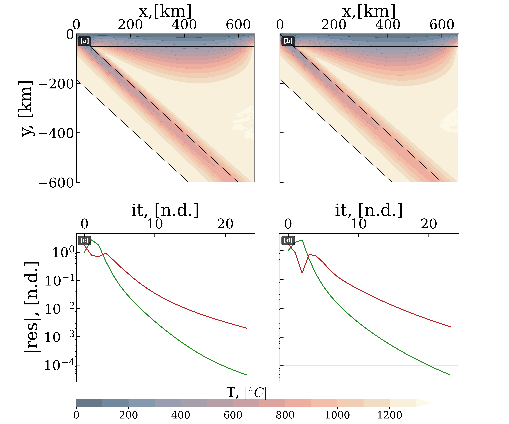

# Examples

## Benchmarks

**StonedFEniCSx** has been tested against the benchmarks of van Zelst et al. (2008). The benchmarks are also used for the testing routines. The table below gives the ranges of the benchmarks and the results of **StonedFEniCSx**. All values are in °C.

| Case | T11,11 range | T11,11 mean | ‖Tslab‖ range | ‖Tslab‖ mean | ‖Twedge‖ range | ‖Twedge‖ mean | T11,11 (this work) | ‖Tslab‖ (this work) | ‖Twedge‖ (this work) |
|------|------|------|------|------|------|------|------|------|------|
| 1c | 387.78–397.55 | 390.47 | 488.00–511.09 | 502.58 | 847.70–854.99 | 851.88 | 389.80 | 505.50 | 855.70 |
| 2a | 570.30–584.20 | 579.09 | 592.80–614.09 | 605.95 | 1000.00–1007.31 | 1003.14 | 573.13 | 602.90 | 1001.10 |
| 2b | 550.17–585.70 | 573.06 | 591.30–608.85 | 601.72 | 984.08–1000.05 | 995.54 | 576.20 | 600.36 | 997.40 |

### Effects of non-linearities on the benchmark values

**Figure 1.** [a]: **Case 2b** steady-state temperature field; [b]: **case 2b non-linear and crustal unit** steady-state temperature field. [c–d]: Convergence rate vs number of iterations. The *green lines* represent the mass, momentum, and energy conservation relative residuum; *red lines* represent the relative combined difference of the solution as a function of iteration.

Case `2b` has been repeated with non-linearities and with crustal units in both the overriding and the subducting plate.

- **case 2b non-linear**: T11,11 = 558.5840 °C, ‖Tslab‖ = 609.5550 °C, ‖Twedge‖ = 942.9349 °C
- **case 2b non-linear and crustal unit**: T11,11 = 599.8287 °C, ‖Tslab‖ = 635.9449 °C, ‖Twedge‖ = 962.3271 °C

In [Figure 1](#fig-benchmark), two representative cases are shown (**Case 2b** and **case 2b non-linear and crustal unit**). The figure has been produced with supplementary scripts that will be released together with the package.

## Sensitivity study

## Mexico example slab

## Time dependent

