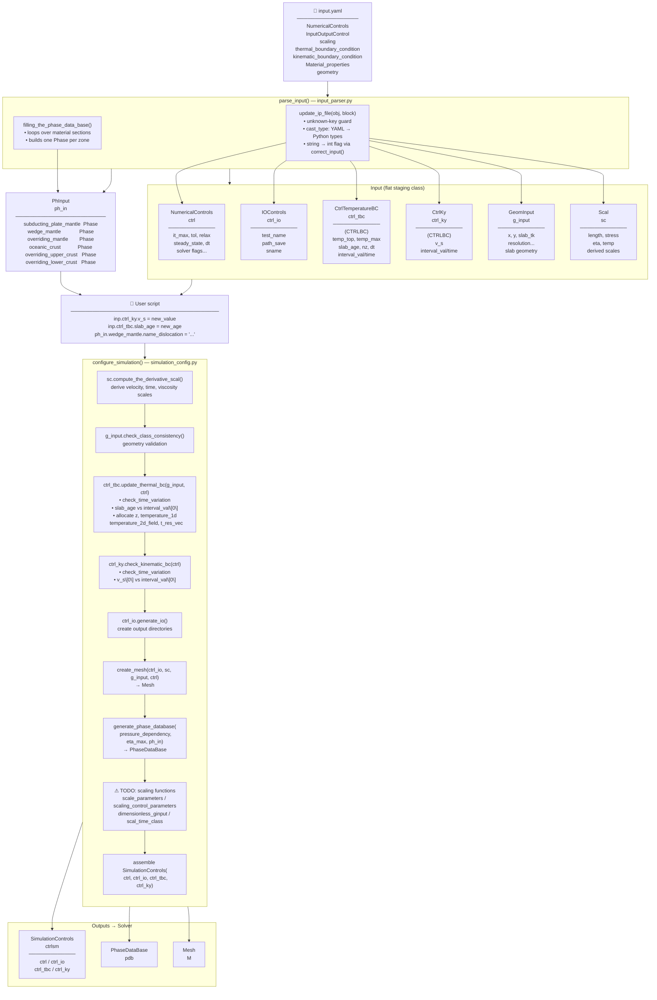
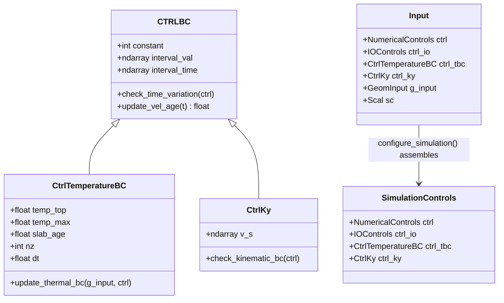

# Config Module — Flow Diagram

```mermaid
flowchart TD

    YAML["📄 input.yaml\n─────────────────\nNumericalControls\nInputOutputControl\nscaling\nthermal_boundary_condition\nkinematic_boundary_condition\nMaterial_properties\ngeometry"]

    subgraph PARSE ["parse_input()  —  input_parser.py"]
        direction TB
        UIP["update_ip_file(obj, block)\n• unknown-key guard\n• cast_type: YAML → Python types\n• string → int flag via correct_input()"]
        FPDB["filling_the_phase_data_base()\n• loops over material sections\n• builds one Phase per zone"]
    end

    subgraph INPUT_CLS ["Input  (flat staging class)"]
        direction LR
        NC["NumericalControls\nctrl\n─────────────\nit_max, tol, relax\nsteady_state, dt\nsolver flags..."]
        IOC["IOControls\nctrl_io\n─────────────\ntest_name\npath_save\nsname"]
        TBC["CtrlTemperatureBC\nctrl_tbc\n─────────────\n(CTRLBC)\ntemp_top, temp_max\nslab_age, nz, dt\ninterval_val/time"]
        KY["CtrlKy\nctrl_ky\n─────────────\n(CTRLBC)\nv_s\ninterval_val/time"]
        GI["GeomInput\ng_input\n─────────────\nx, y, slab_tk\nresolution...\nslab geometry"]
        SC["Scal\nsc\n─────────────\nlength, stress\neta, temp\nderived scales"]
    end

    PHIN["PhInput\nph_in\n─────────────────────────\nsubducting_plate_mantle  Phase\nwedge_mantle             Phase\noverriding_mantle        Phase\noceanic_crust            Phase\noverriding_upper_crust   Phase\noverriding_lower_crust   Phase"]

    USER["👤 User script\n─────────────────────────────────────────\ninp.ctrl_ky.v_s = new_value\ninp.ctrl_tbc.slab_age = new_age\nph_in.wedge_mantle.name_dislocation = '...' "]

    subgraph CONFIGURE ["configure_simulation()  —  simulation_config.py"]
        direction TB
        SCAL["sc.compute_the_derivative_scal()\nderive velocity, time, viscosity scales"]
        GCHECK["g_input.check_class_consistency()\ngeometry validation"]
        UTBC["ctrl_tbc.update_thermal_bc(g_input, ctrl)\n• check_time_variation\n• slab_age vs interval_val\[0\]\n• allocate z, temperature_1d\n  temperature_2d_field, t_res_vec"]
        CKBC["ctrl_ky.check_kinematic_bc(ctrl)\n• check_time_variation\n• v_s\[0\] vs interval_val\[0\]"]
        GIO["ctrl_io.generate_io()\ncreate output directories"]
        MESH["create_mesh(ctrl_io, sc, g_input, ctrl)\n→ Mesh"]
        PDB["generate_phase_database(\n  pressure_dependency, eta_max, ph_in)\n→ PhaseDataBase"]
        TODO["⚠ TODO: scaling functions\nscale_parameters / scaling_control_parameters\ndimensionless_ginput / scal_time_class"]
        ASSEMBLE["assemble SimulationControls(\n  ctrl, ctrl_io, ctrl_tbc, ctrl_ky)"]
    end

    subgraph OUT ["Outputs → Solver"]
        CTRLSM["SimulationControls\nctrlsm\n─────────────\nctrl / ctrl_io\nctrl_tbc / ctrl_ky"]
        PDBOUT["PhaseDataBase\npdb"]
        MESHOUT["Mesh\nM"]
    end

    YAML --> PARSE
    UIP --> NC & IOC & TBC & KY & GI & SC
    FPDB --> PHIN
    PARSE --> INPUT_CLS
    PARSE --> PHIN
    INPUT_CLS --> USER
    PHIN --> USER
    USER --> CONFIGURE
    SCAL --> GCHECK --> UTBC --> CKBC --> GIO --> MESH --> PDB --> TODO --> ASSEMBLE
    CONFIGURE --> CTRLSM & PDBOUT & MESHOUT
```

## Class inheritance

```mermaid
classDiagram
    class CTRLBC {
        +int constant
        +ndarray interval_val
        +ndarray interval_time
        +check_time_variation(ctrl)
        +update_vel_age(t) float
    }
    class CtrlTemperatureBC {
        +float temp_top
        +float temp_max
        +float slab_age
        +int nz
        +float dt
        +update_thermal_bc(g_input, ctrl)
    }
    class CtrlKy {
        +ndarray v_s
        +check_kinematic_bc(ctrl)
    }
    class SimulationControls {
        +NumericalControls ctrl
        +IOControls ctrl_io
        +CtrlTemperatureBC ctrl_tbc
        +CtrlKy ctrl_ky
    }
    class Input {
        +NumericalControls ctrl
        +IOControls ctrl_io
        +CtrlTemperatureBC ctrl_tbc
        +CtrlKy ctrl_ky
        +GeomInput g_input
        +Scal sc
    }

    CTRLBC <|-- CtrlTemperatureBC
    CTRLBC <|-- CtrlKy
    Input --> SimulationControls : configure_simulation() assembles
```
